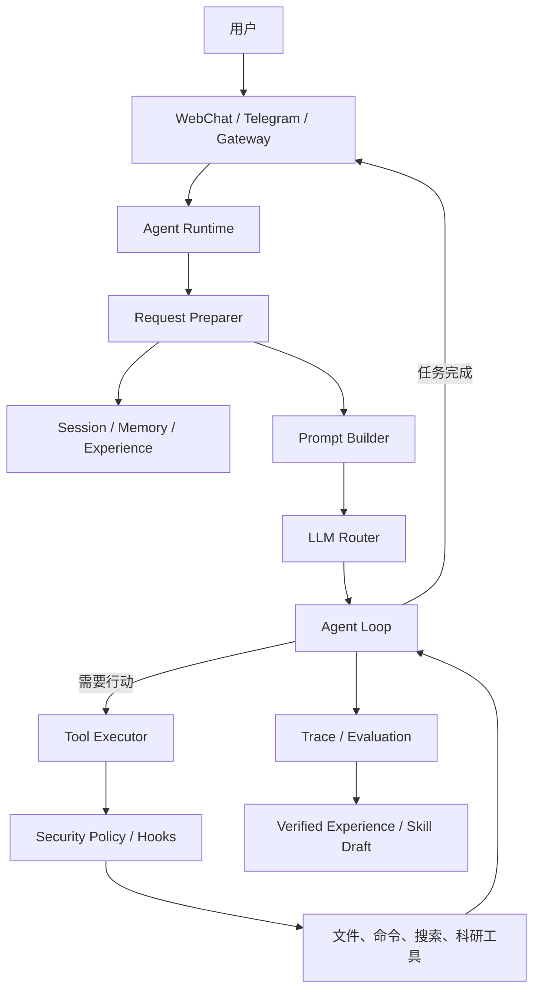

# MiniClaw

一个用于学习、理解和实践 **LLM Agent** 的本地化框架。

MiniClaw 从大语言模型最基本的“根据上下文预测下一个 Token”出发，逐步补齐一个 Agent 真正需要的能力：对话协议、上下文管理、长期记忆、工具调用、任务规划、多 Agent 协作、知识检索、安全控制，以及可审计的自我演进。

> 项目目前处于持续开发阶段，适合 Agent 原理学习、科研工作流实验和本地原型验证，不建议未经安全评估直接用于生产环境。

## 为什么要从 LLM 走向 Agent

LLM 本质上是一个概率模型。它接收已有的 Token 序列，预测下一个 Token，再把新 Token 接回上下文继续生成，直到遇到终止条件。因此，模型本身并不会自动拥有以下能力：

- 它不知道如何保存跨会话信息；
- 它不能直接读取文件、执行程序或访问外部系统；
- 它不会天然拆解复杂任务并持续检查进度；
- 它无法独立保证工具调用安全、结果可信或过程可追溯。

Agent 的作用，就是在 LLM 外围建立一套运行时系统，把“生成文本的模型”扩展成“能够感知上下文、采取行动、保存经验并完成任务的智能体”。

MiniClaw 对应地实现了下面这条完整链路：

```text
用户输入
   ↓
Channel / Gateway
   ↓
会话、记忆与经验检索
   ↓
Prompt 构建与 LLM 路由
   ↓
规划 → 工具调用 → 结果回填 → 继续推理
   ↓
响应、轨迹、研究证据与可验证经验
```

## 核心能力

### 1. 统一的 LLM 接口

`miniclaw/llm/` 负责把不同模型提供商统一到同一套对话接口中，支持：

- OpenAI 兼容接口；
- 主模型与备用模型路由；
- 多轮消息和工具调用协议；
- 流式输出；
- 超时、重试与模型降级。

这层解决的是“怎样稳定地与 LLM 对话”，但尚未赋予模型记忆和行动能力。

### 2. 会话、记忆与上下文压缩

`miniclaw/memory/` 和会话管理模块负责保存对话状态，并在上下文过长时进行压缩。系统会组合当前会话、用户记忆、相关经验和任务信息，让模型在有限的上下文窗口中获得尽可能有效的信息。

这里需要区分两个概念：

- **上下文**：本次请求中真正发送给模型的内容；
- **记忆**：保存在模型之外、可以在后续请求中再次检索的信息。

因此，“Agent 有记忆”并不意味着 LLM 参数发生了变化，而是运行时在每次调用前，把相关信息重新放回上下文。

### 3. 工具调用与安全执行

`miniclaw/tools/` 将文件操作、命令执行、搜索、通信和科研工作流封装为结构化工具。Agent 可以让 LLM 决定调用哪个工具，再由运行时负责参数解析、权限检查、实际执行和结果回填。

执行层包含：

- 工具注册与统一调用协议；
- Agent Profile 的工具白名单；
- 幂等控制和超时限制；
- 调用前后的 Hook；
- 高风险操作审批；
- 运行轨迹和结果记录。

LLM 只负责提出行动意图，真正的系统操作始终由受控的执行层完成。

### 4. Agent 循环与任务规划

Agent 不只调用模型一次。运行时会重复执行“思考—调用工具—观察结果—继续推理”，直到模型给出最终答案、任务完成，或达到轮次与时间限制。

对于复杂任务，MiniClaw 还提供规划模式和项目任务管理。规划阶段会限制具有副作用的工具，让 Agent 先理解目标、拆分步骤，再进入执行阶段。

### 5. 多 Agent 协作

`miniclaw/agents/` 使用声明式 Profile 描述不同 Agent 的身份、工具权限和技能范围。协调 Agent 可以把任务委派给子 Agent，并通过并发上限控制资源使用。

这种设计不是简单地“多调用几次模型”，而是让不同角色拥有明确的职责和能力边界。

### 6. Skills 与专业知识

`miniclaw/skills/` 提供渐进式技能加载机制。系统只在需要时加载对应技能，避免把所有说明一次性塞入上下文。

项目还包含面向科研场景的扩展：

- GPUMD 文档与教程的本地知识检索；
- 语义向量检索和关键词回退；
- MDSynth 工作流桥接；
- 研究胶囊（Research Capsule），用于保存证据、文件哈希和复现清单。

### 7. 可审计的自我演进

`miniclaw/learning/` 会记录任务轨迹，从成功和失败中提取候选经验。经验需要经过评估后才能被标记为可信，并在后续任务中按需注入。

源码级演进默认关闭。即使启用，也会在隔离的 Git Worktree 中生成补丁并执行测试，不会直接把模型生成的代码自动合并到主分支。

## 系统架构



## 快速开始

### 1. 获取项目

```bash
git clone <your-repository-url>
cd openclaw-study
```

### 2. 创建虚拟环境并安装依赖

```bash
python -m venv .venv
```

Windows PowerShell：

```powershell
.\.venv\Scripts\Activate.ps1
pip install -r requirements.txt
```

macOS / Linux：

```bash
source .venv/bin/activate
pip install -r requirements.txt
```

建议使用 Python 3.10 或更高版本。

### 3. 配置模型密钥

默认配置使用 DeepSeek，并兼容 OpenAI 风格的模型服务。不要把真实密钥写入 Git 仓库。

Windows PowerShell：

```powershell
$env:DEEPSEEK_API_KEY="your-api-key"
```

macOS / Linux：

```bash
export DEEPSEEK_API_KEY="your-api-key"
```

也可以使用统一变量 `MINICLAW_API_KEY`。如果在 `miniclaw/config.yaml` 中切换了提供商，系统还会尝试读取对应的 `<PROVIDER>_API_KEY`，例如 `OPENAI_API_KEY`。

### 4. 启动 MiniClaw

```bash
python main.py
```

默认服务地址：

- WebChat：<http://127.0.0.1:8000>
- WebSocket Gateway：`ws://127.0.0.1:18789`

按 `Ctrl+C` 可以触发优雅退出。

## 配置说明

仓库内的默认配置位于 `miniclaw/config.yaml`。加载优先级如下：

1. `MINICLAW_CONFIG` 指定的配置文件；
2. MiniClaw Home 下的用户配置 `config.yaml`；
3. 仓库内置的 `miniclaw/config.yaml`。

常用环境变量：

| 变量 | 作用 |
| --- | --- |
| `MINICLAW_API_KEY` | 通用 LLM 密钥 |
| `<PROVIDER>_API_KEY` | 提供商专用密钥，例如 `DEEPSEEK_API_KEY` |
| `MINICLAW_CONFIG` | 指定配置文件路径 |
| `MINICLAW_HOME` | 指定 MiniClaw 的数据主目录，默认 `~/.miniclaw` |
| `MINICLAW_WORKSPACE` | 指定工作区目录，默认 `~/.miniclaw/workspace` |
| `MINICLAW_AUTH_TOKEN` | Gateway 鉴权 Token |
| `MINICLAW_EMBEDDING_API_KEY` | RAG 向量服务密钥 |
| `ARK_API_KEY` | RAG 向量服务的备用密钥变量 |

需要调整模型、端口、调度器、RAG 或演进功能时，建议复制 `miniclaw/config.yaml` 到本地私有位置，再通过 `MINICLAW_CONFIG` 指向它。

### 可选：启用 Telegram

默认只启用 WebChat。若要启用 Telegram，需要额外安装依赖，并在私有配置文件中开启对应 Channel、填写 Bot Token：

```bash
pip install -r miniclaw/requirements.txt
```

请勿提交包含 Bot Token 的配置文件。

## 项目结构

```text
openclaw-study/
├── main.py                    # 应用入口与服务编排
├── miniclaw/
│   ├── agents/                # Agent Profile 与多 Agent 协作
│   ├── channels/              # WebChat、Telegram 等交互渠道
│   ├── gateway/               # WebSocket Gateway
│   ├── hooks/                 # 生命周期与工具调用 Hook
│   ├── learning/              # 经验提取、评估与演进
│   ├── llm/                   # 模型接口、路由与流式调用
│   ├── memory/                # 记忆、上下文与会话能力
│   ├── projects/              # 规划模式和项目任务管理
│   ├── rag/                   # 专业知识库与检索
│   ├── runtime/               # Agent Loop、Prompt 与执行生命周期
│   ├── skills/                # 技能发现与渐进式加载
│   ├── tools/                 # 工具注册、安全策略与执行
│   ├── config.yaml            # 默认配置
│   └── settings.py            # 配置加载与路径管理
├── scripts/                   # 验收、索引与辅助脚本
├── tests/                     # 自动化测试
└── docs/                      # 项目文档
```

## 测试

运行完整测试：

```bash
python -m pytest -q
```

仓库中的 `scripts/acceptance_stage*.py` 用于验证不同开发阶段的端到端能力。提交功能改动前，建议同时运行相关阶段的验收脚本。

## 安全边界

MiniClaw 允许 Agent 调用本地工具，因此使用时请注意：

- 使用专门的工作目录，不要把敏感目录直接暴露给 Agent；
- API Key、Bot Token 和访问凭据只通过环境变量或未跟踪的本地配置提供；
- 高风险工具应保持审批模式，不要轻易放宽 Profile 权限；
- 在启用命令执行、浏览器控制、外部通信或源码演进前，先检查对应配置；
- 模型输出可能出错，科研结论和自动生成脚本仍需人工复核。

## 演示

- [力学拉伸自主模拟](./力学拉伸自主模拟.mp4)
- [相变自主模拟](./相变自主模拟.mp4)

## 当前定位

MiniClaw 不是对某个成熟 Agent 产品的完整复刻，而是一个强调“模块如何连接”的学习型实现。项目希望回答的核心问题是：

> 如何把一个只能继续生成 Token 的 LLM，逐步构造成一个有上下文、有记忆、能使用工具、会规划、可协作并且受安全边界约束的 Agent？

如果你也在学习 Agent 架构，欢迎通过 Issue 交流设计思路、使用反馈和改进建议。
